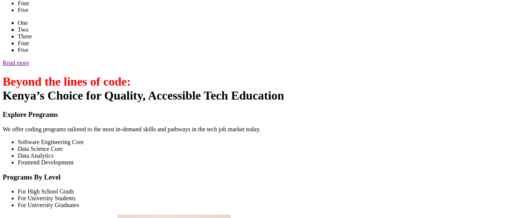
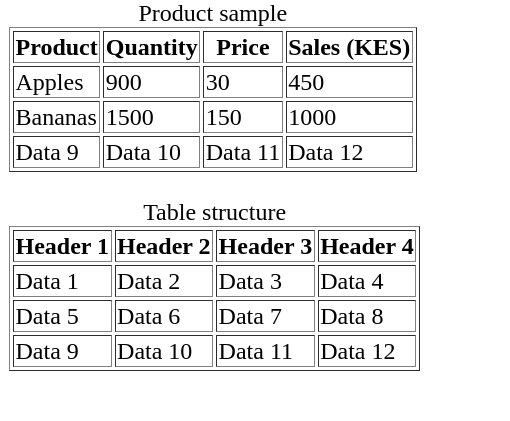
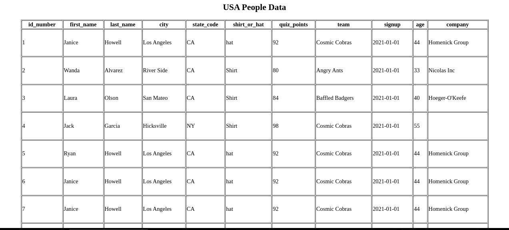

# Learning html Tags
## Table of contents
- About the project
- Getting started
- Screenshots
- License
- Contact
## About the Project
 This is an introduction to the most essential html tags, that are mostly used in structuring a webpage
 ## Getting Started
 The following project is about learning text tags, table tags, list tags and also learning the overall structure of html and also some bit of styling.
 ## Screenshots

## License
[MIT]

